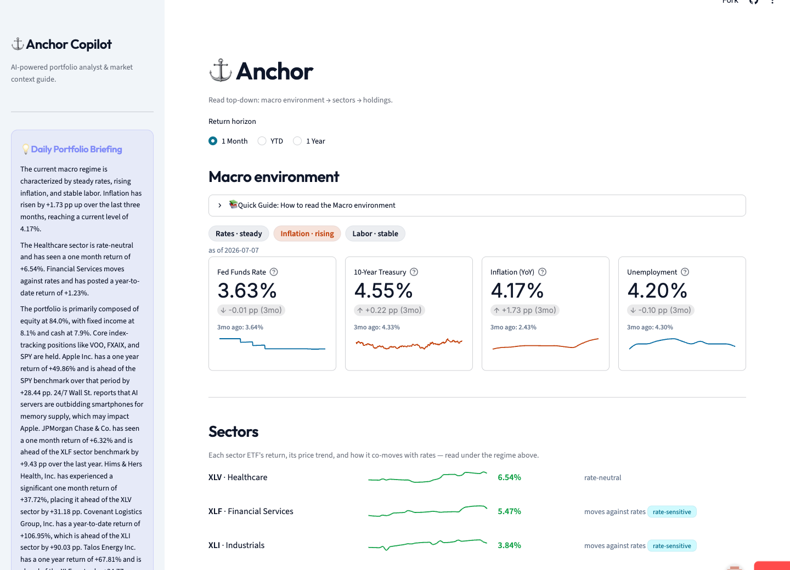

# Anchor

**A macro-aware personal investment dashboard.** Anchor enforces one reading order,
**macro environment → sector performance → individual holdings**, so every number is
read in the context of the tier above it. You don't look at a stock's move in isolation;
you read it under its sector, and its sector under the macro regime.

**[Live dashboard](https://anchor-dashboard.streamlit.app)** ·
**[dbt docs & lineage](https://timurakhtemov.github.io/Anchor/)** ·
[Architecture](docs/architecture.md) · [Setup](docs/setup.md)



This is a portfolio project targeting analytics-engineering roles. The deliverable is
the **build**: layered dbt modeling, deliberate design decisions, and honest treatment
of limitations, not just a working chart.

## What's here

- **A full bronze → silver → gold → serve pipeline**, green at 140/140 dbt nodes
  (18 models, 118 tests, 1 SCD2 snapshot, 2 seeds, 1 hook), deployed and documented.
- **Dynamic, multi-asset holdings.** A real portfolio (SnapTrade live pull or Fidelity
  CSV) feeds the gold layer. Five asset classes route through one generic benchmark model
  to up to five comparison axes each.
- **Structural privacy.** Demo and real portfolios build into physically separate
  BigQuery dataset families. A compile-time hook refuses to build a public target from
  real data. The public deploy cannot leak real holdings, even by mistake.
- **A local-LLM daily briefing** (Ollama) generated from the gold marts into a
  schema-validated tour script, served in the dashboard sidebar and as a Next.js
  scroll-told tour in `web/`.
- **The ops layer.** CI runs pytest, `dbt build`, and a Playwright smoke test on every
  pull request. dbt docs publish to GitHub Pages. A Dagster `dagster-dbt` asset graph
  runs ingestion, dbt, and the serve export as one lineage.

## The core idea

Relationships belong in the data layer, not the UI. The dashboard never joins two
independent cuts and hopes they line up: a holding's return is computed *together with*
its benchmark's return as a single row; a sector's rate co-movement is a column on the
sector model; the macro regime is a synthesized artifact. If the framing matters, it
lives in gold.

## Key design decisions

- **Benchmark on the marginals.** Each stock is benchmarked on its **sector** ETF *and*
  its **cap-style** ETF (Large→SPY, Mid→MDY, Small→IWM). A single sector × cap ETF
  doesn't exist as a liquid instrument, so when the joint cell doesn't exist, benchmark
  on the marginals.
- **One generic benchmark model, routed by asset class.** A holding has N benchmarks,
  each tagged with a `benchmark_type`; the comparison is always holding% − benchmark%.
  Equities get sector + cap-style, equity funds get market, bonds get bond-market +
  duration. Commodities and alts intentionally route to zero axes rather than a forced,
  meaningless comparison. A new axis is a seed row. Full design:
  `docs/make_it_real_design.md`.
- **Root rule.** A holding whose only routed benchmark is itself (held SPY on the market
  axis) suppresses the self-pairing and displays as the reference point. VOO-vs-SPY is
  *not* suppressed: tracking difference is a real comparison.
- **Live classification for stocks, maintained override for funds.** Sector and market
  cap come straight from yfinance for individual equities. Funds are different: yfinance
  returns no category for Fidelity mutual funds, so an equity fund and a bond fund are
  metadata-indistinguishable. Fund classes come from a maintained mapping, checked before
  the fallback, with a guardrail that fails the build on any unclassified held fund.
- **Dual-source valuation.** Market-valued rows recompute `quantity × latest_close` so
  weights stay fresh between imports. Cash and plan-internal instruments keep the
  import's own value. A guardrail fails the build if any normally-priced instrument is
  ever import-valued, so a transiently unpriced ticker fails loudly instead of going stale.
- **Realized co-movement, not hardcoded narratives.** The sector tier shows each sector's
  *measured* trailing correlation with rates. This surfaced financials moving *against*
  rates in one window, contra the "banks like higher rates" story, which a hardcoded
  seed would have gotten confidently wrong.
- **Common as-of date, defensive bars.** Every return is measured to one shared date,
  anchored to the benchmark-ETF trading calendar, and models filter to the latest
  *complete* close because yfinance can return a trailing bar with volume but null OHLC.
- **Grains, contracts, and knobs.** Composite keys are asserted, the two load-bearing
  marts carry enforced dbt contracts, an exposures file declares the downstream
  consumers, and the in-line band, regime thresholds, and trend windows are all dbt vars.

## Product principles

Anchor is a portfolio-understanding product, not a market-monitoring one. Daily settled
closes are the operating cadence; intraday prices and 1D views are deliberately out of
scope. The reading order stays macro → sectors → holdings. The briefing explains what
happened and never predicts or recommends. Every number carries an as-of date, missing
data stays visibly missing, and restrained color keeps gains and losses from becoming the
page's emotional center. The feature test: does this help someone understand their
portfolio, or react faster to the market? If the latter, it doesn't belong here.

## Limitations

Surfacing these is the point. Analytical maturity is knowing what your numbers don't say.

- **Quantities are as-of the last import; prices are daily.** Between holdings pulls,
  market value mixes a fresh price with a stale share count.
- **The CSV real-import path is unvalidated** against an actual Fidelity export; SnapTrade
  became the primary transport.
- **Commodity and alt holdings are display-only.** No routed benchmark axis in v1; they
  show weight and value with an explicit "not benchmarked" line.
- **Cost basis sums across accounts and treats nulls as zero**, which understates basis
  and overstates unrealized gain when one account doesn't report it.
- **Duration buckets are hand-assigned per fund.** No metadata source derives them.
- **Cap-weighted benchmarks partly benchmark themselves.** AAPL is a large chunk of XLK.
- **CPI lags.** The regime's inflation dimension is about two months staler than rates.
- **Co-movement is descriptive and noisy.** A trailing correlation, not a sensitivity.
- **Freshness rides yfinance.** Free, scraped, no SLA. Migration path in
  `docs/ingestion_roadmap.md`.
- **The briefing table sits outside dbt lineage**, and the Dagster graph runs locally, not
  on a schedule yet.

## Roadmap

Both capstones the project was scoped around have shipped: the ops layer (deploy, docs,
CI, orchestration) and the multi-asset "make it real" milestone (`handoff.md` records
what shipped and where it deviated from `docs/make_it_real_design.md`). What's next
deepens trust and reflection rather than the speed of market feedback:

1. **Unattended post-close operation** on Dagster+ Serverless, demo-only by construction.
2. **Reliable settled end-of-day data** per `docs/ingestion_roadmap.md`.
3. **Grounded portfolio history**: allocation drift, concentration, contribution.
4. **The Daily Note briefing** (`docs/briefing_daily_note_design.md`, phase 1 shipped).
5. **Intent and reflection**: theses, target allocations, invalidation criteria.

## Tech stack

BigQuery · dbt (fusion locally, core in CI; `dbt_utils`, `codegen`) · Python ingestion
(`requests`, `yfinance`, `pandas`, SnapTrade SDK) · Streamlit + Altair · Ollama
(`gemma4:31b`) · Next.js static export + Playwright · Dagster (`dagster-dbt`) · GitHub
Actions

## Repo layout

```
ingestion/       bronze ingestion: FRED, yfinance, holdings loader + SnapTrade
transformation/  the dbt project: models (staging / intermediate / marts), macros,
                 seeds (benchmark axes, fund classes), snapshots, singular tests
app/             Streamlit serve layer, data seam, LLM briefing generator, exporters
web/             Next.js tour surface (static export, Playwright tests)
orchestration/   Dagster code location: ingestion + dbt + snapshot as one asset graph
data/            committed sample portfolio; private/ (real inputs, gitignored)
docs/            architecture, setup, and the design documents behind each decision
```
