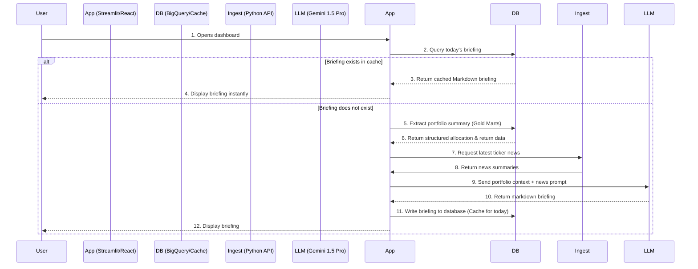

# Roadmap: AI Investment Analyst & Daily Briefing Agent

## Background & Vision
Once the portfolio is ingested, classified, and benchmarked (via our Gold marts), we want to provide users with an **AI Investment Analyst**. 

Instead of just showing static tables and charts, the dashboard will feature an AI-driven interface that explains *why* the portfolio is performing the way it is, grounding its analysis on:
1.  **Gold Marts Data** (weights, returns, active benchmark outperformance/underperformance across multiple axes).
2.  **Latest Market News** related to their held tickers.
3.  **Macro Trends** (interest rates, inflation, etc.).

The entry point for this feature is a **Daily Portfolio Briefing Agent** that generates a 3-paragraph executive summary when the user first logs in or opens the dashboard.

---

## Architecture Flow



---

## Core Components

### 1. Database Cache Schema (`portfolio_briefings`)
To avoid calling the LLM API on every page refresh, briefings are cached daily.

```sql
CREATE TABLE portfolio_briefings (
    portfolio_id STRING NOT NULL,
    generated_date DATE NOT NULL,
    briefing_text STRING NOT NULL,
    generated_at TIMESTAMP DEFAULT CURRENT_TIMESTAMP(),
    PRIMARY KEY (portfolio_id, generated_date)
);
```

### 2. Context Extraction (Data Seam)
We write a python function to query the dbt-generated Gold tables and format them into a highly dense, token-efficient text block for the LLM. 

```python
def get_portfolio_context(portfolio_id: str) -> str:
    # Query gold.portfolio_composition and gold.holdings_benchmarks
    # Formats a clean text representation:
    context = """
    Portfolio Allocation: 60% Equity (Large Blend, Technology), 35% Fixed Income (Intermediate), 5% Commodities.
    Total Return YTD: +10.2%
    Benchmark Performance:
    - Equity holdings (VOO) matched SPY (+10.2% YTD)
    - Fixed Income holdings (BND) returned -1.2% YTD (vs AGG: -1.1%, vs IEF: -0.8% [duration axis])
    - Commodity holdings (GLDM) returned +8.5% YTD (No active benchmark)
    """
    return context
```

### 3. News Ingestion Hook
We write a python helper using `yfinance` or a financial news feed (like AlphaVantage) to scrape recent headlines/summaries for the active tickers.

```python
def fetch_ticker_news(tickers: list[str]) -> str:
    # Query RSS/News API for each ticker in the portfolio
    # Formats into: "Ticker: [Headline] - [Summary]"
    return news_text
```

### 4. Agent Prompts
We use **Gemini 1.5 Pro** due to its massive context window (to absorb news) and strong quantitative reasoning skills.

**System Prompt:**
> You are Anchor's AI Investment Analyst. Your role is to write a daily executive portfolio briefing for the user.
> Explain their YTD return and highlight which holdings beat or lagged their respective benchmarks.
> Cross-reference their performance with recent news (e.g., if bond yields spiked, note how that impacted their intermediate-duration fixed income assets).
> Keep the tone objective, analytical, and professional. Use markdown formatting. Limit the output to 3 short paragraphs.

---

## Future Enhancements
*   **Conversational Q&A**: Let the user ask follow-up questions, e.g., *"Why did my technology sector underperform XLK this month?"* or *"Summarize the risk in my commodities position."*
*   **Custom Position Groups**: Let the user select specific checkboxes in the UI (e.g., selecting all bond funds) and click "Analyze selection" to trigger a targeted LLM analysis of just those assets.
*   **Alerts**: Proactive AI notifications, e.g., *"We noticed news indicating a management change in one of your held funds. Here is the summary."*
