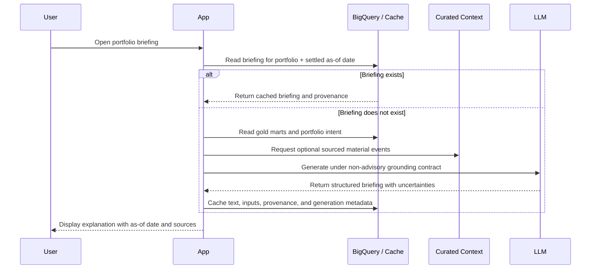

# Roadmap: Grounded Portfolio Briefing

_Status: deferred. This direction is subordinate to Anchor's product principles in the
README: portfolio understanding, settled context, and reflection—not market monitoring,
prediction, or trade execution._

## Background and vision

Once a portfolio is ingested, classified, and benchmarked through the gold marts,
Anchor can explain how its pieces behaved together. The briefing should reduce the work
of interpreting the dashboard without increasing the urge to react to ordinary market
movement.

Its grounded inputs are:

1. **Gold marts** — allocation, settled returns, and active benchmark differences.
2. **Macro context** — rates, inflation, labor, and their measured direction.
3. **Curated material events** — optional, sourced context relevant to existing
   positions; never an infinite or engagement-driven news feed.
4. **Portfolio intent** — future theses, target allocations, review dates, and stated
   invalidation criteria supplied by the user.

The first release is a short post-close or weekly portfolio briefing. “Daily” describes
the maximum generation cadence, not a reason to prompt the user to check the app daily.

## Product constraints

- Use completed daily data and display the shared as-of date.
- Describe what changed, how it relates to the portfolio, and what remains uncertain.
- Never predict prices, rank trade opportunities, or recommend buying or selling.
- Do not use ordinary price movement as an alert trigger.
- Distinguish measured facts from model-generated interpretation.
- Cite any external event used in the explanation.
- Cache each briefing so page refreshes cannot produce shifting narratives from the
  same underlying data.
- Prefer restrained language: no urgency, fear, hype, or engagement hooks.

## Architecture flow



## Core components

### 1. Briefing cache

The cache key must include the portfolio and settled data date. Persisting provenance
makes a briefing reproducible and inspectable rather than ephemeral generated text.

```sql
create table portfolio_briefings (
    portfolio_id string not null,
    as_of_date date not null,
    briefing_text string not null,
    input_fingerprint string not null,
    source_metadata json,
    generated_at timestamp default current_timestamp(),
    primary key (portfolio_id, as_of_date)
);
```

### 2. Context extraction seam

A deterministic function should serialize only modeled facts the briefing needs:

- allocation and concentration;
- selected settled return horizon;
- holding-versus-benchmark differences on each valid axis;
- macro regime and measured changes;
- material portfolio drift;
- user-authored intent, when available;
- explicit missing data and unbenchmarked positions.

The same payload should be stored or fingerprinted with the generated briefing so the
output can be traced back to its inputs.

### 3. Optional event context

External context is a supplement, not the product's center. Include only events that are
material to an existing holding or portfolio assumption, retain source links and event
timestamps, and cap the number of items. If trustworthy context is unavailable, the
briefing should remain useful using gold marts alone.

### 4. Model contract

Choose the model and provider at implementation time behind a small interface; the
product contract matters more than a provider-specific integration. Require structured
output with sections such as:

- **Portfolio structure:** allocation, concentration, and drift.
- **What changed:** settled performance in benchmark and macro context.
- **What to review:** questions tied to the user's stated intent, not trade instructions.
- **Uncertainty and missing context:** limitations that constrain the explanation.

The system instruction must explicitly prohibit predictions, target prices, security
rankings, and buy/sell/hold recommendations.

## Evaluation and guardrails

Before release, test the briefing against fixed mart fixtures and require that it:

- reproduces all cited numbers exactly;
- never invents a benchmark for an unbenchmarked asset;
- preserves the selected horizon and common as-of date;
- separates sourced events from inferred interpretation;
- remains useful with no external news;
- refuses requests for personalized trade instructions while still explaining the
  portfolio context;
- produces materially stable output for identical cached inputs.

## Later enhancements

- **Explanatory Q&A:** questions such as “why did this holding lag its benchmark?” with
  the same settled-data and non-advisory contract.
- **Position-group reflection:** analyze a user-selected asset class or thesis as a
  coherent group.
- **Intent review:** surface positions whose allocation or evidence has moved outside a
  user-defined range and ask whether the original thesis still applies.
- **Scheduled check-ins:** reminders for a review date or stale thesis—not notifications
  for routine price movement.
