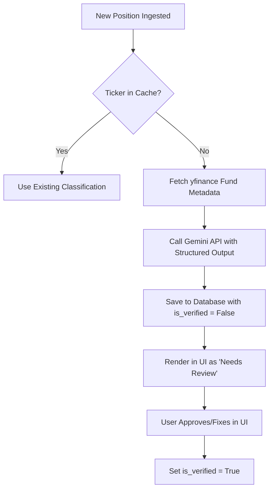

# Roadmap: AI-Assisted Fund Classification

## Background & Problem Statement
Currently, Anchor relies on a manually maintained CSV file (`fund_classifications.csv` / `fund_classifications_real.csv`) to resolve ETF and Mutual Fund tickers to their proper asset classes (`equity`, `fixed_income`, `commodity`, `cash`, `alt`) and duration buckets (`short`, `intermediate`, `long`).

While this keeps the pipeline free and 100% accurate, it is not scalable for multiple users or long-term maintenance. When a user buys a new fund, the dbt build fails until they manually edit the CSV.

## Proposed Solution: LLM-Assisted Curation
We can automate this process by utilizing a low-cost, fast Large Language Model (e.g., **Gemini 1.5 Flash**) in the ingestion pipeline. The LLM will classify new funds on-the-fly using the fund description fetched from Yahoo Finance.

To guarantee data integrity, we will enforce **Structured JSON Outputs** and implement a **Human-in-the-loop (HITL)** verification flag in the database.

---

## Technical Architecture



### 1. Programmatic API Call (Python)
We define a strict schema using Pydantic and invoke the LLM with structured schemas. This ensures the LLM's response always conforms to our database constraints (preventing typos or invalid categories).

```python
from typing import Literal, Optional
from pydantic import BaseModel, Field
from google import genai
from google.genai import types

# Define our allowed database schemas
class FundClassification(BaseModel):
    asset_class: Literal['equity', 'fixed_income', 'commodity', 'cash', 'alt'] = Field(
        description="The primary asset class of the fund."
    )
    sub_style: Optional[Literal['short', 'intermediate', 'long']] = Field(
        default=None,
        description="For fixed_income, the duration bucket. Null for other asset classes."
    )
    rationale: str = Field(
        description="A short 1-sentence explanation of why this classification was chosen."
    )

def classify_fund_with_ai(ticker: str, fund_name: str, description: str) -> FundClassification:
    client = genai.Client()
    
    prompt = f"""
    You are an expert investment data analyst. Classify the following fund based on its profile:
    Ticker: {ticker}
    Name: {fund_name}
    Description: {description}
    """
    
    response = client.models.generate_content(
        model='gemini-1.5-flash',
        contents=prompt,
        config=types.GenerateContentConfig(
            response_mime_type="application/json",
            response_schema=FundClassification,
            temperature=0.1,  # Keep responses highly deterministic
        ),
    )
    
    return FundClassification.model_validate_json(response.text)
```

### 2. Database Schema Extension
In the BigQuery database, the `raw_holdings` / `fund_classifications` schema will be extended to include:
*   `is_verified (BOOLEAN)`: Set to `FALSE` for AI-generated guesses; `TRUE` once approved by a human.
*   `rationale (STRING)`: The AI's explanation, visible to the user when verifying.

### 3. Streamlit UI Component
In the Anchor UI, a small settings page or banner will appear if there are unverified funds:

> ⚠️ **New Funds Detected**
> We found a new fund in your portfolio (**GLDM**). We have classified it as **Commodity** (Rationale: *SPDR Gold MiniShares Trust holds physical gold bullion*).
> `[ Approve ]` or `[ Change Classification ]`

---

## Advantages
*   **Zero-Maintenance**: Users do not need to edit CSV files or write code to add funds.
*   **Near-Zero Cost**: Small prompts using Gemini 1.5 Flash cost roughly \$0.000075 per API call (less than 1 cent for 100 funds).
*   **Resilience**: The structured output schema guarantees that the LLM cannot output values that would break the dbt tests/build.
*   **Auditable**: The verification flag maintains 100% data integrity while automating 99% of the tedious work.
